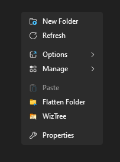

# folderFlattener

A Windows context menu utility that "flattens" folder hierarchies by moving all nested files to a root directory.

## What It Does

folderFlattener recursively moves all files from subdirectories into a single root directory while maintaining clear naming to avoid file collisions. This is useful for:

- Extracting all files from deeply nested archive structures
- Organizing downloads scattered across multiple folders
- Consolidating files from complex directory hierarchies
- Cleaning up folder structures while preserving file organization through naming

### Key Features

- **Recursive file extraction**: Moves all nested files to the root directory
- **Smart naming**: Renames files to include their original subdirectory path (e.g., `subfolder_filename.ext`)
- **Collision prevention**: Automatically handles duplicate filenames with numeric suffixes
- **String filtering**: Removes unwanted strings from filenames (customizable in the script)
- **Partial file cleanup**: Removes incomplete `.part` files (common in downloads)
- **Automatic cleanup**: Deletes empty subdirectories after file extraction
- **Context menu integration**: Right-click on any folder to flatten it
- **Safe operations**: Uses literal path handling to avoid issues with special characters

## Getting Started

### Download

1. Download or clone this repository
   ```
   git clone https://github.com/yourusername/folderFlattener.git
   ```
   Or download the ZIP file and extract it

### Installation

1. Run `install.bat` as Administrator
2. The script will be installed to `Program Files\folderFlattener` and registered with Windows Registry
3. After installation completes successfully, you can **delete the downloaded/extracted files** - they are no longer needed
4. Restart Windows Explorer (or log out and back in) to apply the context menu changes
5. The context menu shortcut will now appear when you right-click any folder

Bonus:
Configure `C:\Program Files\folderFlattener\main.ps1` on line 60 to customize unwanted strings to remove from filenames

## Usage

### Via Context Menu (Recommended)
1. Right-click any folder in Windows Explorer
2. Select "Flatten Folder" from the context menu
3. Wait for the operation to complete

### Via Command Line
```powershell
powershell -File main.ps1 -WorkingDir "C:\path\to\folder"
```

## How It Works

When you flatten a folder:

1. All files from subdirectories are moved to the root directory
2. Files are renamed with their original path prepended (e.g., `subfolder\file.txt` → `subfolder_file.txt`)
3. If a file already exists, a numeric suffix is added (e.g., `subfolder_file_1.txt`)
4. Unwanted strings are removed from filenames (configurable in the script)
5. Incomplete `.part` files are deleted
6. Empty subdirectories are automatically removed

### Example

**Before:**
```
MyFolder/
├── Downloads/
│   ├── file1.txt
│   └── subdownloads/
│       └── file2.pdf
├── Archives/
│   └── report.docx
└── file3.jpg
```

**After:**
```
MyFolder/
├── file3.jpg
├── Downloads_file1.txt
├── Downloads_subdownloads_file2.pdf
└── Archives_report.docx
```

## Uninstalling

Run `uninstall.bat` as Administrator to remove the context menu integration and the script files.

## Requirements

- Windows 7 or later
- PowerShell 3.0 or later (included with Windows 7 SP1+)
- Administrator privileges (for registry modifications during installation)

## License

See [LICENSE](LICENSE) file for details.

## Credits

- Icon: [Move To Folder](https://icons8.com/icon/hkFlMzuC0WxN/move-to-folder) by [Icons8](https://icons8.com)


<sub>Context menu made "sexy" with [IMA-Menu](https://github.com/iMAboud/iMA-Menu)</sub>
